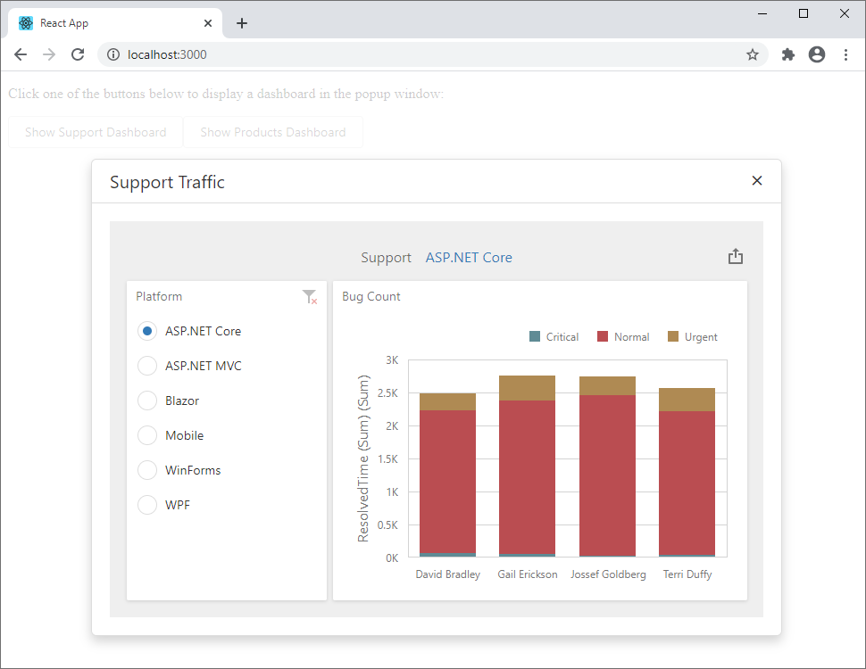

# How to display the Web Dashboard in a popup (React)

This example illustrates how to use the React-based `DashboardControl` component to diplay a dashboard in the [DevExtreme Popup widget](https://js.devexpress.com/Documentation/ApiReference/UI_Widgets/dxPopup/).



See the following file for implementation details:

- [App.js](./dashboard-react-app/src/App.js)

The example uses a modular approach that based on the client-server model. You need a server (backend) project and a client (frontend) application that includes all the necessary styles, scripts and HTML-templates. Note that the script version on the client should match with libraries version on the server up to a minor version.

- The [asp-net-core-server](asp-net-core-server) folder contains an ASP.NET Core 3.1 Dashboard application.
- The [dashboard-react-app](dashboard-angular-app) folder contains a client application.

## Quick Start

In the **asp-net-core-server** folder run the following command:

```
dotnet run
```
> This server allows CORS requests from _all_ origins with _any_ scheme (http or https). It is insecure because any website can make cross-origin requests to the app. We recommend you to specify the client application's URL directly to prohibit any client from getting access to your server with personal info. Learn more: [Cross-Origin Resource Sharing (CORS)](https://docs.devexpress.com/Dashboard/400709)

In the **dashboard-react-app** folder, run the following commands:

```
npm start
```

Open ```http://localhost:3000/``` in your browser to see the result.

## Documentation
- [Add Web Dashboard to a React Application](https://docs.devexpress.com/Dashboard/400683/web-dashboard/dashboard-component-for-react/add-web-dashboard-to-a-react-application?v=20.2)
- [Dashboard Component for React](https://docs.devexpress.com/Dashboard/401977/web-dashboard/dashboard-component-for-react?v=20.2)
- [Cross-Origin Resource Sharing (CORS)](https://docs.devexpress.com/Dashboard/400709?v=20.2)

## Examples
- [Dashboard Client-Side Application (React)](https://github.com/DevExpress-Examples/dashboard-react-app)
- [Dashboard React Example](https://github.com/DevExpress-Examples/dashboard-react-example)
